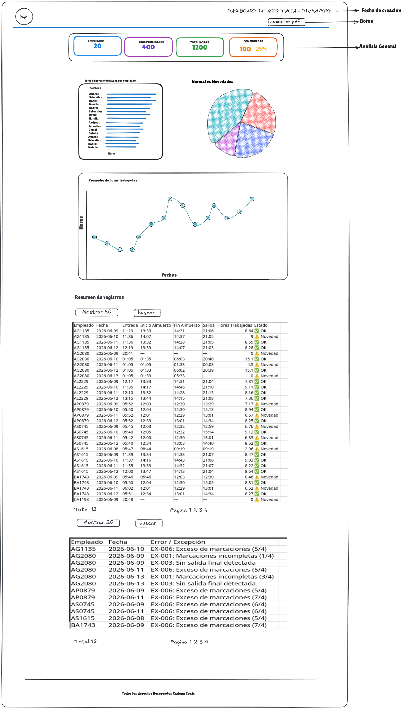
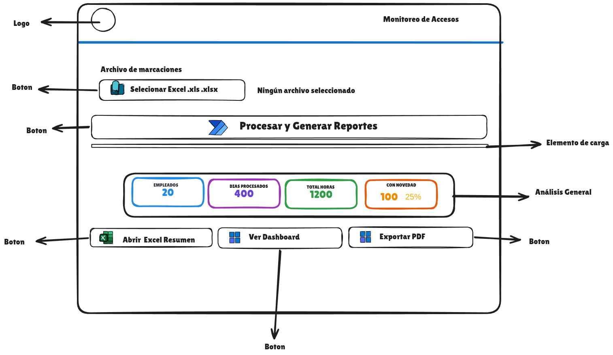

# 📋 Plan de Desarrollo — Procesador de Registros de Asistencia

## 1. Visión General del Proyecto

### Objetivo
Desarrollar una aplicación que procese automáticamente los registros de ingreso y salida de los empleados de la empresa a partir de un archivo suministrado en formato Excel. 

Ademas de generar un resumen de horas trabajadas, detecte inconsistencias y produzca un Dashboard interactivo en HTML de alto nivel.

### Nombre del Proyecto
```
procesador-asistencia Coats Cadena /
```

## 2. Stack Tecnológico

| Categoría | Librería | Justificación |
|---|---|---|
| **Procesamiento Excel** | `pandas`, `xlrd` | Lectura robusta de formato antiguo `.xls` y manipulación de DataFrames |
| **Lógica de negocio** | `datetime` | Cálculo preciso de horas trabajadas incluyendo exactitud en segundos |
| **Interfaz gráfica** | `customtkinter` | GUI nativa, moderna, oscura y elegante con uso de multihilo (`threading`) para no congelar la pantalla |
| **Exportación Excel** | `pandas`, `openpyxl` | Generación del archivo resumen y archivo de novedades |
| **Reportes visuales** | `plotly` | Documentos HTML interactivos con gráficos dinámicos, sin depender de Quarto ni software de terceros |
| **Control de versiones** | `git` | Flujo de trabajo profesional con ramas y commits semánticos |
|**Manejo de imagenes**|`pillow| Libreria para el manejo de imagen en las interfaces visuales |


### Se desarrolla en python y sus siguientes librerias 

#### MANEJO DE DATOS Y EXCEL

**pandas>=2.2.0**           # El motor principal para procesar y limpiar los datos.

**openpyxl>=3.1.2**         # Permite leer y escribir archivos Excel modernos (.xlsx).

**xlsxwriter>=3.2.0**       # Permite darle formatos bonitos y colores a las celdas al guardar en Excel.

**xlrd>=2.0.1**             # Permite leer el formato antiguo de Excel (.xls), indispensable para Data.xls.

#### INTERFAZ GRÁFICA (GUI) 

**customtkinter>=5.2.2**   # Construye la ventana moderna, oscura y elegante.

####  DASHBOARD Y GRÁFICOS 

**plotly>=5.22.0**          # Genera los gráficos interactivos (barras, dona, líneas) para el reporte HTML.

#### UTILIDADES EXTRA 
**loguru>=0.7.2**           # Permite imprimir mensajes de colores en la terminal si hay errores.

**pytest>=8.2.0**           # Usado para hacer pruebas automáticas al código.

**pytest-cov>=5.0.0**       # Mide qué porcentaje del código ha sido probado por pytest.

**customtkinter>=5.2.2**    # Modernizar la interfaz gráfica

**pillow**                  # Manejo de imagenes en una interfaz gráfica

## 3 Arquitectura de Datos — Flujo de Procesamiento

```
[ Data.xlsx ] (Archivo bruto)
       │
       ▼
 [ lector_excel.py ] (Limpieza de datos y ordenamiento cronológico)
       │
       ▼
 [ procesador.py ] (Agrupación, cálculo de horas y detección de inconsistencias)
       │
       ├─► [ resumen.xlsx ] (Reporte de horas trabajadas por empleado)
       │
       └─► [ novedades.xlsx ] (Registro de marcas incompletas o duplicadas)

``` 


## 4. Reglas de Negocio Implementadas

### Fórmula de horas trabajadas

`Horas = (Salida - Entrada) - (Fin Almuerzo - Inicio Almuerzo)`

### Catálogo de Excepciones Detectadas (Novedades)

El algoritmo es capaz de detectar y clasificar las siguientes alertas para Recursos Humanos:

- **Falta de marcas:** Días con menos de 4 marcas (EJ: solo marcó entrada y almuerzo).
- **Olvidó salida:** Días donde la última marca está ausente.
- **Marcas dobles/duplicadas:** El empleado colocó el dedo varias veces seguidas arruinando la secuencia del día.
- **Exceso de marcas:** Más de 4 marcas válidas en el día.

En caso de alerta crítica, el día se etiqueta como **⚠ Novedad** y se excluye del cálculo normal para no arrojar horas trabajadas falsas.




- Manejo de colores corporativos.

- Disposición de los elementos fijos, utilizando una plantilla HTML con inyección de código Python (funcionalidad de reporte).

- Ventana GUI flotante para visualización básica de la información y procesamiento de los archivos:

      - Agregar archivo.
      - Botón para ejecutar el componente procesador de asistencia y sus dependencias para la extracción y procesamiento de la información.
      - KPI (Total empleados - Días procesados - Horas trabajadas - Elementos con novedad y su porcentaje).



Dashboard Web
- Banner superior (Header)
      - Logo.
      - Fecha de realización del reporte.
      - Botón de exportación a PDF.

- Contenido (Body)
      - KPI (Total empleados - Días procesados - Horas trabajadas - Elementos con novedad y su porcentaje).
      - Gráfico de barras de visualización de rendimiento de cada trabajador en el periodo.
      - Gráfico de dona de visualización comparativa de porcentaje de días normales con novedad.
      - Gráfico de línea para la tendencia de horas trabajadas.

- Tabla similar a la exportada en Excel (novedades, resumen):
      - Filtro total de vista de filas y campo para buscar por nombre de empleado.